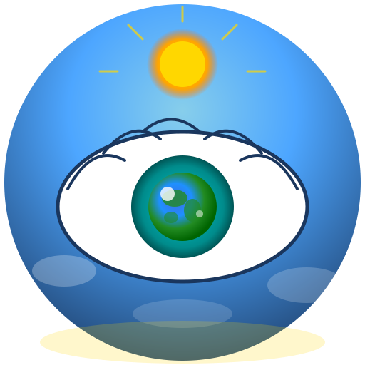

# LiveSight - See Beyond Barriers

<div align="center">



**AI-Powered Navigation Assistant for Visually Impaired Users**

*Powered by Google Gemini Live API*

[](package.json)
[](capacitor.config.ts)
[](https://ai.google.dev/)

</div>

---

## Overview

LiveSight is a real-time AI navigation assistant designed to help visually impaired users navigate the world safely and independently. Using Google's Gemini Live API with multimodal capabilities, LiveSight provides:

- **Real-time scene description** via camera analysis
- **Voice interaction** in Turkish language
- **Hazard detection** including vehicles, obstacles, and stairs
- **Haptic feedback** for alerts and navigation cues
- **Fall detection** with automatic SOS

## Tech Stack

| Category | Technology |
|----------|------------|
| Frontend | React 19, TypeScript |
| Build | Vite 6 |
| Mobile | Capacitor 8 |
| AI | Google Gemini 2.0 Flash (Live API) |
| Audio | Web Audio API, PCM 16-bit |
| Haptics | Capacitor Haptics Plugin |

## Quick Start

### Prerequisites
- Node.js 18+
- Android Studio (for Android builds)
- Gemini API Key from [Google AI Studio](https://aistudio.google.com/)

### Installation

```bash
# Install dependencies
npm install

# Development
npm run dev

# Build for production
npm run build

# Build for Android
npm run build:mobile
npm run android
```

### Environment Setup

Create `.env.local` with your Gemini API key:

```env
VITE_GEMINI_API_KEY=your_api_key_here
```

## Project Structure

```
livesight/
├── src/
│   ├── assets/          # Images, icons
│   ├── components/      # React components
│   ├── constants/       # App configuration
│   ├── features/        # Feature modules
│   ├── hooks/           # Custom React hooks
│   ├── services/        # API services
│   ├── types/           # TypeScript definitions
│   └── utils/           # Utility functions
├── android/             # Android native code
├── ios/                 # iOS native code
└── dist/                # Production build
```

## Key Features

### 1. Real-Time AI Vision
- Continuous camera frame analysis
- Scene description and object recognition
- Turkish language responses

### 2. Vehicle Danger Detection
- Critical, warning, and awareness levels
- Haptic feedback patterns for each level
- Voice alerts for approaching vehicles

### 3. Fall Detection
- Accelerometer-based detection
- "Are you okay?" check-in system
- Automatic SOS after 3 unanswered prompts

### 4. Haptic Feedback
- Native Capacitor Haptics integration
- Distinct patterns for different alerts
- Direction cues (left/right/forward/stop)

## API Reference

### LiveSightService

```typescript
const service = new LiveSightService(
  apiKey: string,
  videoElement: HTMLVideoElement,
  settings: UserSettings,
  weather: WeatherContext,
  callbacks: LiveSightCallbacks
);

await service.start();
service.stop();
service.setMute(muted: boolean);
```

### Hooks

```typescript
// Haptic feedback
const { vehicleCritical, vehicleWarning, fallDetected } = useHaptic();

// Fall detection
const { startMonitoring, confirmOkay, onFallDetected } = useFallDetection();

// Permissions
const { requestPermissions, permissions } = usePermissions();
```

## Capacitor Plugins

| Plugin | Version | Purpose |
|--------|---------|---------|
| @capacitor/camera | 8.0.0 | Camera access |
| @capacitor/geolocation | 8.0.0 | Location services |
| @capacitor/haptics | 8.0.0 | Vibration feedback |
| @capacitor/share | 8.0.0 | Share location |
| @capacitor/splash-screen | 8.0.0 | Splash screen |
| @capacitor/status-bar | 8.0.0 | Status bar control |

## Development

```bash
# Type check
npm run type-check

# Lint
npm run lint

# Format
npm run format

# Android development
npm run android:run
```

## License

MIT License - See [LICENSE](LICENSE) for details.

---

<div align="center">

**Built with Gemini AI**

*Empowering independence through AI innovation*

</div>
